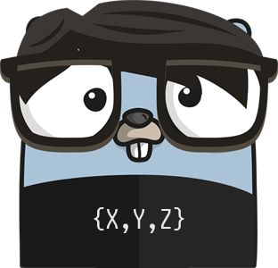

# vec3

<p align="center">
  
</p>

forked from shindakun to add extra funcs

## Installation

If you are a Go user you can run `go install github.com/mbcx4jrh/vec3`.

## Functions

func Distance(a, b Vector3) float32  
func DistanceSquared(a, b Vector3) float32  
func Add(a, b Vector3) Vector3  
func Subtract(a, b Vector3) Vector3  
func Mult(a Vector3, b float32) Vector3  
func Normalize(a Vector3) Vector3  
func Dot(a, b Vector3) float32  
func Cross(a, b Vector3) Vector3  
func (a Vector3) Length() float32  
func (a Vector3) LengthSqr() float32

## Usage example

The following code

```go
v1 := vec3.Vector3{X: 1, Y: 1, Z: 0}
v2 := vec3.Vector3{X: 1, Y: 1, Z: 0}
newV := vec3.Add(v1, v2)
fmt.Println(newV)
```

results in the new vector of `{2 2 0}`.